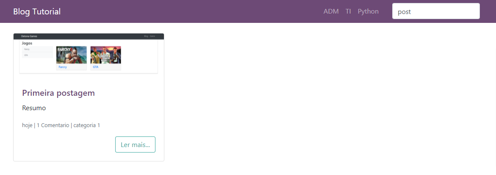
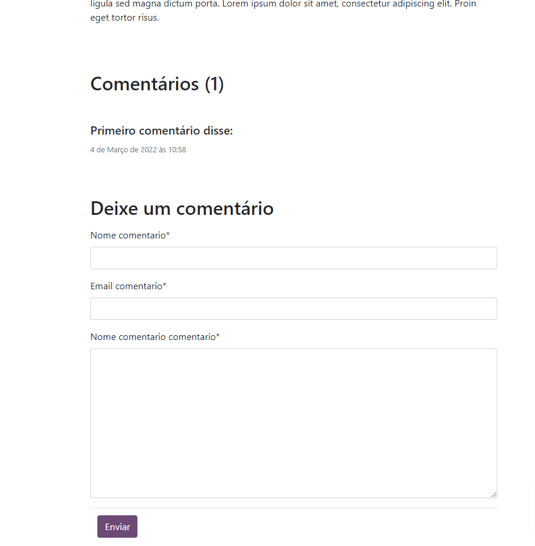
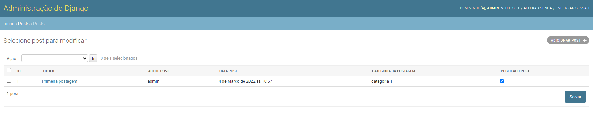
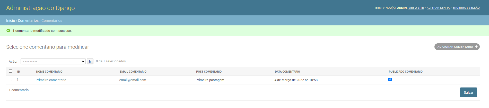

# blog-django2.0

## Resumo e descrição do projeto
Projeto desenvolvido em django, onde a ideia é criar um blog que pode conter comentários, mas para ser visível é necessário a autorização <br/>Podemos adicionar também uma postagem semelhante a uma time line.
<br/>
Pode realizar pesquisa pelo titulo ou autor
## Assets

  
  
  
  


## Instalação
Criar o virtual env
```python
python -m venv venv
```

Ativar o virtual env
```python
source venv/scrip/active
```
Instalar dependências
```python
pip install -r requeriments.txt
```
Rodar migrate
```python
python manage.py migrate
```

Criar super usuário
```python
python manage.py createsuperuser
```
Rodar o projeto
```python
python manage.py runserver
```
Acessar  o painel do django Admin para criar os conteúdos
DNS/admin


